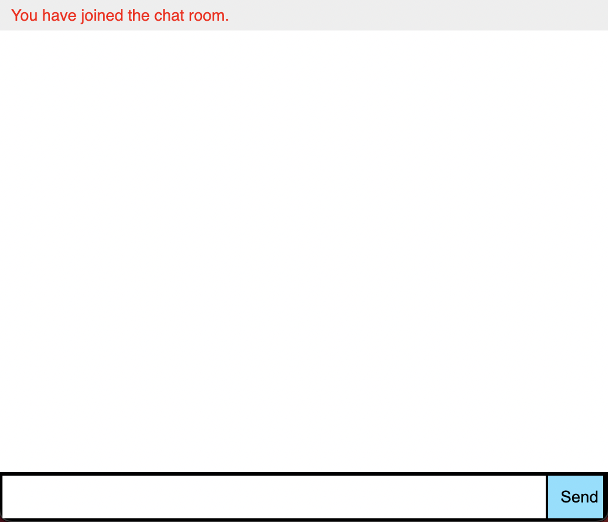
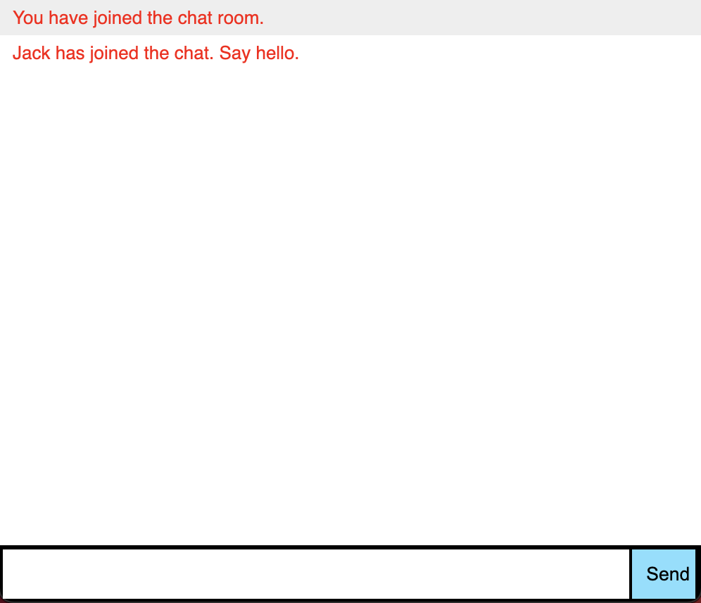
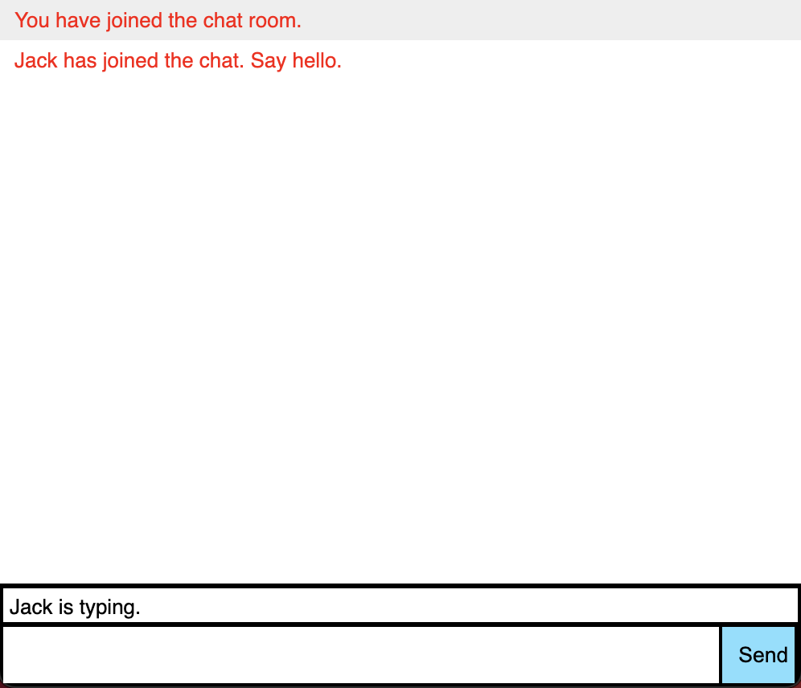
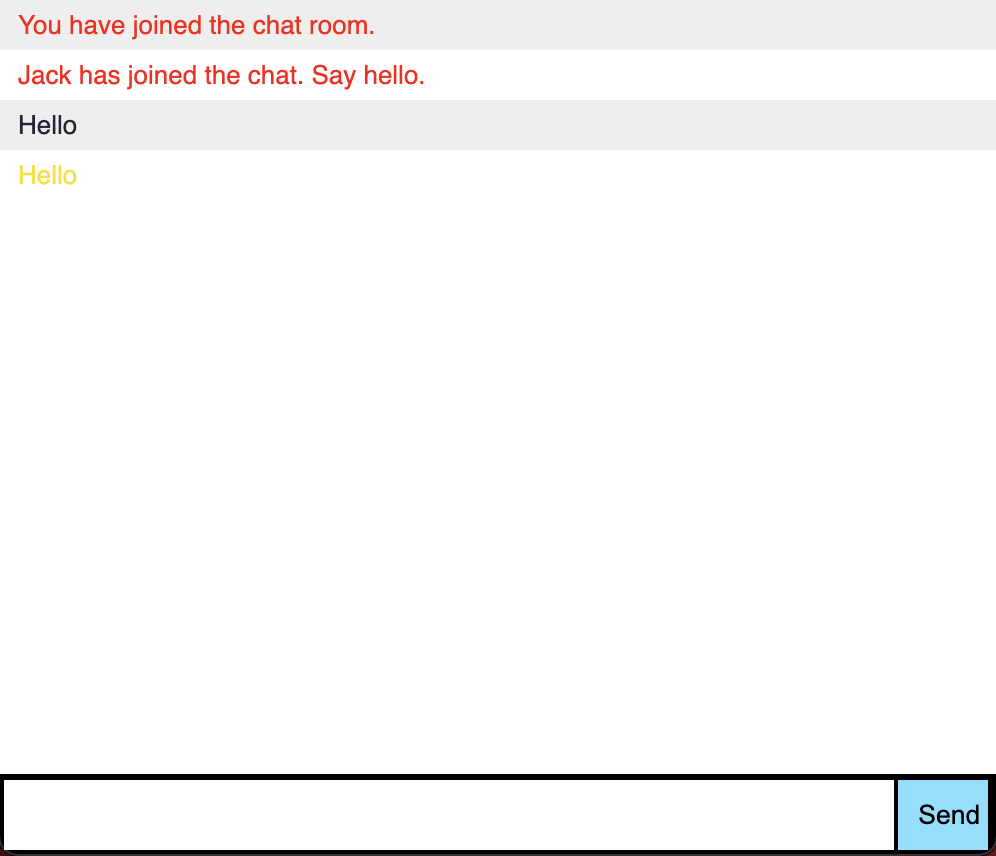

# ChatApp
A simple chat application using [Socket.io](https://socket.io/).

## Overview
The application is a simple chat app, that uses websockets ([Socket.io](https://socket.io/)) for real time message between the user conencted.

The Chat app has the following features:
1. Users select there name during connection to the server.
1. Realtime messages broadcasted to all the user connected to the chat room.
1. Users have unique color to their message to easily distinguish between messages.
1. Message indicating that a user is typing.
1. Server message when a user joins or leaves the chat room.

## Installation
1. run `npm install`
1. run `npm start`

## How it works

### Joining the chat room
opening the browser to `http://localhost:3000/`, you will be prompted to enter a nickname to identify the user.

### Another member joins
Open another window in your browser and connect to `http://localhost:3000/`, and enter a new nickname and join

You will get a message from the server that the new user has joined the chat room.

### Someones is typing
When typing in chat input field all other users in the chat room will be notified that the user is typing.

### Realtime Messaging
Entering a message and clicking the send button or pressing enter will send the message to all the users connected to the chat room.

The messaged will be displayed in the appropriate color selected by the server when joining the chat room.

## Improvements and new features
1. Create a list of all the users connect to the chat room.
1. Add multiple chat rooms
1. Allow users to customize their message color.
1. Allow user to change their nickname
